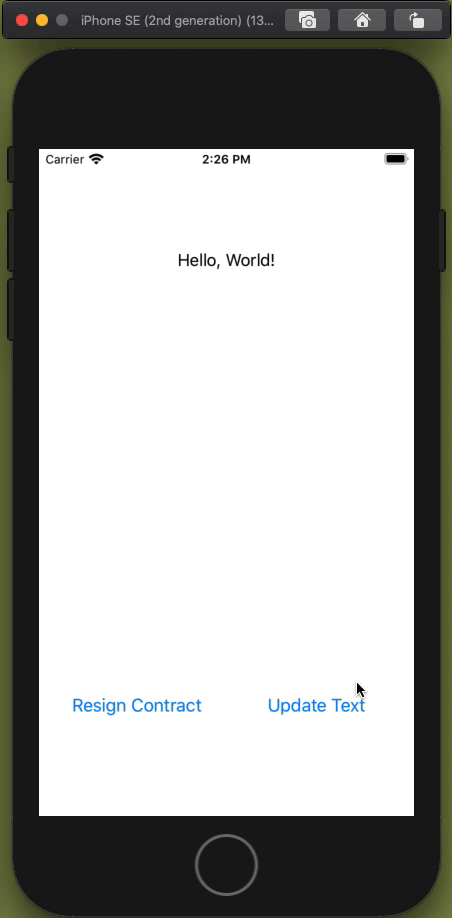

# Contract-UI-Demo

## Demo Video


## Example Code
```swift
import UIKit
import Later
import SwiftUIKit

class ViewController: UIViewController {
    let textContract = Contract<String>()
    let label = Label("❗️👀")
    
    override func viewDidLoad() {
        super.viewDidLoad()
        
        textContract
            .onChange { value in
                Later.main { [weak self] in
                    self?.label.text = value
                }
        }
        .onResign { lastValue in
            Later.main { [weak self] in
                self?.label.text = "Contract was Resigned\nLast Value: \(lastValue ?? "-1")"
            }
        }
        
        textContract.value = "Hello World"
        
        view.embed {
            VStack(distribution: .fillEqually) {
                [
                    label
                        .text(alignment: .center)
                        .number(ofLines: 3),
                    Spacer(),
                    HStack(distribution: .fillEqually) {
                        [
                            Button("Resign Contract") { [weak self] in
                                self?.textContract.resign()
                            },
                            Button("Update Text") { [weak self] in
                                self?.textContract.value = "Now: \(Date().timeIntervalSince1970)"
                            }
                        ]
                    }
                    .padding()
                ]
            }
        }
    }
}
```
